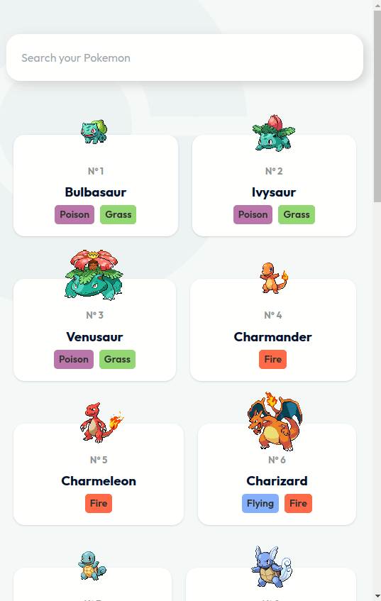

## Pokedex

A simple application used to search and view pokemon information, built with React, TailwindCSS, and Cypress for E2E testing. [Live Demo](https://poke-dex-blond.vercel.app/)

## Screenshots

#### Desktop

#### Mobile

<svg xmlns="http://www.w3.org/2000/svg">
<foreignObject width="200" height="500">
    

</foreignObject>
</svg>
 

## Installation and Setup Instructions

Clone down this repository. You will need `node`, `cypress` and `npm` installed globally on your machine.

Installation:

`npm install`

To Run Test Suite:

`npm run cypress:open`

To Start Server:

`npm run dev`

To Visit App:

`localhost:5173/`

## Features

- Responsive
- Search Pokemon by name
- View 898 Pokemon information

## Concepts applied to project

- Lazy loading
  - pokemon images to increase page load speed
  - components with suspend
- List virtualization/windowing PokemonList

## Credits

- [Design by AC1design](https://dribbble.com/shots/15128634-Pokemon-Pokedex-Website-Redesign-Concept)
- [PokeAPI](https://pokeapi.co/)

## License

[MIT](LICENSE) Copyright (c) 2023 Kris Collins
